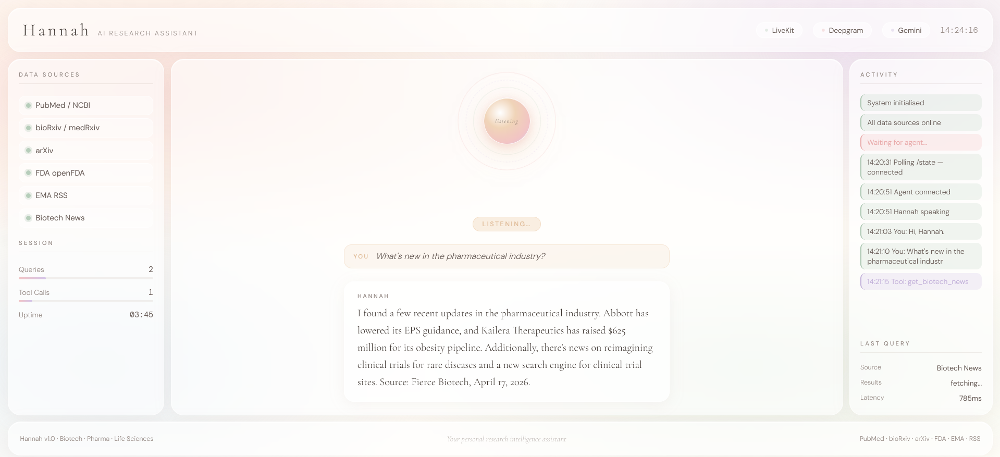
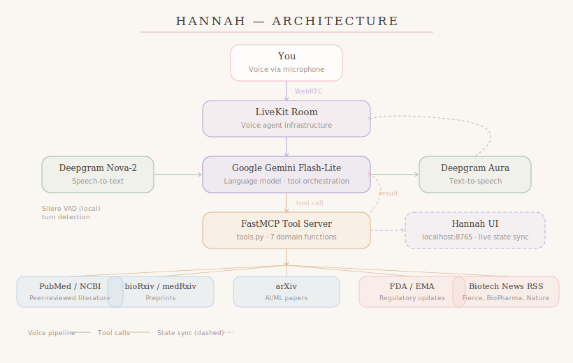

# Hannah — AI Research Assistant 🧬🎙️

> A real-time voice AI assistant for biotech, pharmaceutical, life sciences,
> bioinformatics, and AI/ML research intelligence.

Hannah listens to your voice, queries live scientific databases and regulatory
feeds in real time, and speaks back concise, sourced answers — all running
locally with a LiveKit voice pipeline, Google Gemini, and Deepgram.

---

## Demo



> **Video demo:** [▶ Watch Hannah in action on YouTube](https://www.youtube.com/watch?v=PkS0ffJoRtQ)

[](https://www.youtube.com/watch?v=PkS0ffJoRtQ)

---

## What Hannah Can Do

Ask Hannah things like:

- *"What are the latest papers on AI in drug discovery this week?"*
- *"Any new FDA drug approvals or safety alerts?"*
- *"Show me recent bioRxiv preprints on single-cell RNA sequencing."*
- *"What's happening in biotech news today?"*
- *"Give me a full update on what's new in CRISPR gene editing."*
- *"Search arXiv for deep learning applied to protein structure prediction."*
- *"Any recent EMA medicine updates?"*

---

## Why This Project Exists

Scientific and regulatory information moves fast. A researcher, analyst, or
student working in the life sciences today has to monitor peer-reviewed
journals, preprint servers, regulatory agency feeds, and industry news
simultaneously — often across multiple platforms, with no single unified view.

Hannah is an attempt to solve that problem through a voice-first AI interface.
Rather than opening five browser tabs and reading through dense abstracts, you
ask a question in plain language and receive a spoken, sourced summary within
seconds. The agent calls the right data sources automatically, synthesises the
results, and speaks back only what is relevant.

---

## Use Cases and Who This Can Help

### Drug Discovery and Pharmaceutical Research

Pharmaceutical scientists and medicinal chemists spend a significant portion of
their working week tracking the literature — monitoring new ADMET results,
target validation studies, and competing pipeline developments. Hannah gives
them a voice-accessible layer over PubMed and bioRxiv, so they can ask
questions like *"What are the newest papers on QSAR models for drug
toxicity?"* or *"Has anything been published on GLP-1 receptor agonists this
month?"* without breaking their workflow to run a database search.

Regulatory affairs professionals can ask Hannah for FDA approval statuses,
adverse event reports, and EMA guidance updates in real time, saving hours of
manual trawling through agency portals.

### Biotechnology and Life Sciences

Biotech teams move quickly and decisions are often time-sensitive — a
competitor's new trial result or a platform technology paper can change a
strategic direction. Hannah gives R&D scientists, project managers, and
business development professionals a single spoken interface to monitor what
is happening across the industry. Questions like *"What are the latest
cell therapy news stories?"* or *"Any new regulatory guidance on gene
therapies in Europe?"* become instant rather than a 20-minute search exercise.

Start-ups and small biotech companies, who often lack dedicated competitive
intelligence functions, stand to benefit particularly. Hannah provides the kind
of real-time awareness that was previously only accessible to larger
organisations with dedicated literature monitoring teams.

### Bioinformatics and Computational Biology

Bioinformaticians live at the intersection of biology and data science, and
the field moves at the pace of both. New tools, benchmarks, and methods appear
weekly on bioRxiv and arXiv. Hannah lets a computational biologist ask *"What
new single-cell RNA-seq methods have been posted on bioRxiv this month?"* or
*"Are there any new deep learning approaches to protein structure prediction
on arXiv?"* and get an immediate spoken briefing, rather than running manual
searches across multiple servers.

This is especially useful during the early stages of a project, when a
researcher is scoping the landscape and needs broad awareness quickly before
going deep on any particular direction.

### Academic Research and Graduate Education

PhD students and postdoctoral researchers are expected to stay current across
a broad literature while also making research progress. Hannah reduces the
cognitive overhead of keeping up. A graduate student can ask *"What is the
latest thinking on CRISPR base editing?"* and get a synthesised answer drawn
from recent publications, preprints, and news — giving them a starting point
for deeper reading, not a replacement for it.

Supervisors and lab heads can use Hannah to do rapid landscape scans before
meetings, grant applications, or conference presentations, without the time
investment of a traditional literature review.

---

## Why This Matters

What makes this approach significant is not simply that it retrieves
information — search engines and database portals have done that for decades.
What is different here is the combination of three things happening together:

**Voice-first interaction** removes the friction of navigating multiple
platforms. You do not need to know which database to search, how to construct
a query, or where the relevant feed lives. You ask in plain language and the
system figures out the rest.

**Multi-source synthesis** means Hannah is not constrained to one data stream.
A single question can trigger simultaneous queries to peer-reviewed literature,
preprints, regulatory feeds, and industry news, returning a unified spoken
summary. This mirrors how a knowledgeable colleague would answer a question
rather than how a database would return a result set.

**Real-time data** ensures the information is current. Hannah does not rely on
a training cutoff or a cached index. Every query hits live APIs and feeds, so
the answer reflects what was published or approved today, not six months ago.

Together, these properties make Hannah a meaningful productivity tool for
anyone who needs to stay informed across a fast-moving technical landscape.
The architecture is domain-agnostic — while this implementation is tuned for
life sciences, the same pattern can be adapted to any field with structured
data sources, from climate science to financial regulation.

---

## Data Sources

| Source | What it provides | API type |
|---|---|---|
| **PubMed / NCBI** | Peer-reviewed biomedical literature | Free REST API |
| **bioRxiv / medRxiv** | Biology and medicine preprints | Free REST API |
| **arXiv** | AI/ML and quantitative biology papers | Free Atom API |
| **FDA openFDA** | Drug approvals, adverse events, news | Free (key optional) |
| **EMA** | European medicine updates | Free RSS |
| **Fierce Biotech** | Biotech industry news | Free RSS |
| **BioPharma Dive** | Pharma business news | Free RSS |
| **BioSpace** | Life sciences news | Free RSS |
| **Nature Biotechnology** | Scientific news | Free RSS |

All data sources are free. No paid subscriptions are required.

---

## Architecture



The pipeline works as follows. Your voice is captured via microphone and
streamed through a LiveKit room over WebRTC. Deepgram Nova-2 transcribes the
audio to text, which is sent to Google Gemini Flash-Lite. When Gemini
determines a data lookup is needed, it calls the FastMCP tool server, which
routes the query to the appropriate source — PubMed, bioRxiv, arXiv, FDA,
EMA, or biotech news RSS feeds. The results return to Gemini, which
synthesises a spoken response. Deepgram Aura converts that text back to
audio, which LiveKit streams to your speakers. A lightweight HTTP server
running alongside the agent pushes live state to `hannah_ui.html`, keeping
the visual interface in sync throughout.

---

## Tech Stack

| Component | Technology |
|---|---|
| Voice agent framework | LiveKit Agents 1.x |
| Speech-to-text | Deepgram Nova-2 |
| Language model | Google Gemini 2.5 Flash-Lite |
| Text-to-speech | Deepgram Aura (Thalia voice) |
| Voice activity detection | Silero VAD (local, free) |
| Tool server | FastMCP |
| Visual interface | Vanilla HTML/CSS/JS served via built-in HTTP server |
| Data APIs | NCBI E-utilities, bioRxiv REST, arXiv Atom, openFDA, RSS |

---

## Setup (Windows)

### Prerequisites

- Python 3.11 or 3.12
- Git installed
- A [LiveKit Cloud](https://cloud.livekit.io) account (free tier)
- A [Google AI Studio](https://aistudio.google.com) API key (free, no card needed)
- A [Deepgram](https://console.deepgram.com/signup) API key (free, $200 credit)
- An [FDA API key](https://open.fda.gov/apis/authentication/) (free, optional)

### 1. Clone the repository

```powershell
git clone https://github.com/Farhan89082/Hannah_Agentic_AI.git
cd Hannah_Agentic_AI
```

### 2. Create a virtual environment

```powershell
python -m venv .venv
.venv\Scripts\activate
```

### 3. Install dependencies

```powershell
pip install -r requirements.txt
```

### 4. Set up your API keys

```powershell
copy .env.example .env
```

Open `.env` and fill in your keys:

```
GOOGLE_API_KEY=your_google_api_key_here
DEEPGRAM_API_KEY=your_deepgram_api_key_here
FDA_API_KEY=your_fda_api_key_here
LIVEKIT_API_KEY=your_livekit_api_key_here
LIVEKIT_API_SECRET=your_livekit_api_secret_here
LIVEKIT_URL=wss://your-project.livekit.cloud
```

> `.env` is listed in `.gitignore` and will never be committed to GitHub.

### 5. Run the smoke tests

```powershell
python tests/test_tools.py
```

All 8 tests should show ✅ before starting the agent.

### 6. Download model files

```powershell
python hannah/agent.py download-files
```

### 7. Start Hannah

```powershell
python hannah/agent.py dev
```

The visual interface opens automatically at `http://localhost:8765`.
Connect via the [LiveKit Agents Playground](https://agents-playground.livekit.io)
in a second tab and start talking.

---

## Project Structure

```
Hannah_Agentic_AI/
├── hannah/
│   ├── __init__.py
│   ├── agent.py          ← LiveKit voice agent + built-in HTTP server
│   └── tools.py          ← FastMCP tool server (all data source functions)
├── tests/
│   └── test_tools.py     ← Smoke tests for all 8 data sources
├── assets/               ← Screenshots and demo media
├── hannah_ui.html        ← Pastel visual interface (auto-opens on startup)
├── .env.example          ← API key template (safe to commit)
├── .gitignore
├── requirements.txt
└── README.md
```

---

## Cost

All data source APIs are completely free. The only running costs are:

| Component | Provider | Free tier |
|---|---|---|
| LLM | Google Gemini (AI Studio) | 20 requests/day, no card needed |
| STT | Deepgram | $200 free credit on signup |
| TTS | Deepgram | Included in $200 credit |
| Voice infrastructure | LiveKit Cloud | Free tier available |

For a typical demo session of 20–30 queries, the Deepgram cost is under $0.10.

---

## Acknowledgements

Built on top of:
- [LiveKit Agents](https://github.com/livekit/agents) — voice agent framework
- [FastMCP](https://github.com/jlowin/fastmcp) — MCP tool server
- [NCBI E-utilities](https://www.ncbi.nlm.nih.gov/books/NBK25500/) — PubMed API
- [bioRxiv API](https://api.biorxiv.org) — preprint data
- [openFDA](https://open.fda.gov) — FDA regulatory data
- Inspired by [friday-tony-stark-demo](https://github.com/SAGAR-TAMANG/friday-tony-stark-demo) by Sagar Tamang

---

## Licence

MIT — see [LICENSE](LICENSE) for details.
